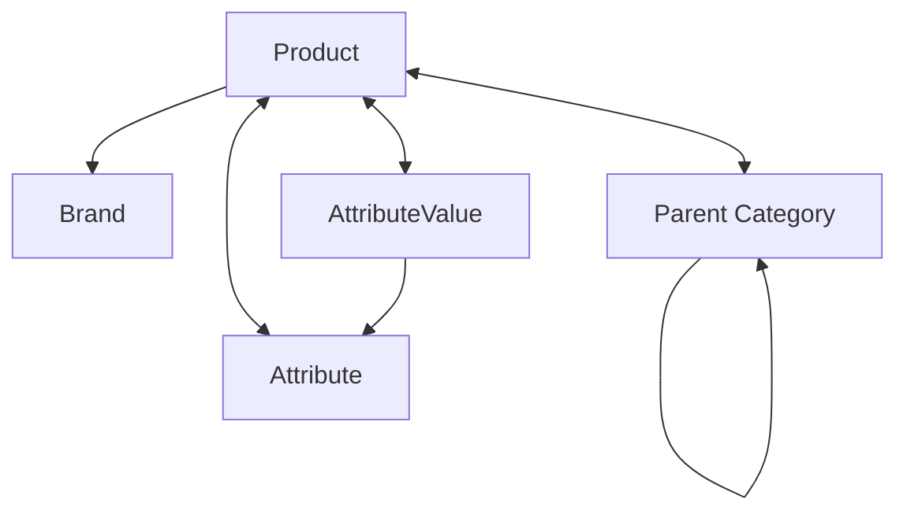

# Data Schema Overview

This document provides an overview of all content types in the perfume store project, their relationships, and how they work together.

## Content Types Overview

| Content Type    | Description                                      | i18n Support |
| --------------- | ------------------------------------------------ | ------------ |
| Product         | Main product content type for perfumes           | ✅ Yes       |
| Category        | Product categories with hierarchical structure   | ✅ Yes       |
| Attribute       | Product characteristics (e.g., fragrance family) | ✅ Yes       |
| Attribute Value | Specific values for attributes (e.g., "Floral")  | ✅ Yes       |
| Brand           | Perfume brands                                   | ✅ Yes       |
| Page            | Static content pages                             | ✅ Yes       |

## Product Schema

The central content type for perfume products.

### Fields

| Field          | Type      | i18n | Description                             |
| -------------- | --------- | ---- | --------------------------------------- |
| title          | String    | ✅   | Product name                            |
| description    | Rich Text | ✅   | Detailed product description            |
| seoTitle       | String    | ✅   | SEO-optimized title                     |
| seoDescription | Text      | ✅   | SEO-optimized description               |
| slug           | UID       | ✅   | URL-friendly identifier                 |
| medusa_id      | String    | ❌   | Medusa product ID (non-editable)        |
| medusa_status  | Enum      | ❌   | Status in Medusa (draft/published/etc.) |

### Relations

| Relation        | Type         | Target         | Description               |
| --------------- | ------------ | -------------- | ------------------------- |
| categories      | Many-to-Many | Category       | Product categories        |
| attributes      | Many-to-Many | Attribute      | Product attributes        |
| attributeValues | Many-to-Many | AttributeValue | Specific attribute values |
| brand           | Many-to-One  | Brand          | Product brand             |

## Category Schema

Hierarchical structure for product categorization.

### Fields

| Field          | Type      | i18n | Description               |
| -------------- | --------- | ---- | ------------------------- |
| name           | String    | ✅   | Category name             |
| description    | Rich Text | ✅   | Category description      |
| slug           | UID       | ✅   | URL-friendly identifier   |
| seoTitle       | String    | ✅   | SEO-optimized title       |
| seoDescription | Text      | ✅   | SEO-optimized description |

### Relations

| Relation | Type         | Target   | Description               |
| -------- | ------------ | -------- | ------------------------- |
| parent   | Many-to-One  | Category | Parent category           |
| children | One-to-Many  | Category | Child categories          |
| products | Many-to-Many | Product  | Products in this category |

## Attribute Schema

Product characteristics/properties (e.g., fragrance family, concentration).

### Fields

| Field       | Type   | i18n | Description                       |
| ----------- | ------ | ---- | --------------------------------- |
| name        | String | ✅   | Attribute name                    |
| description | Text   | ✅   | Attribute description             |
| key         | String | ❌   | Unique identifier (non-localized) |

### Relations

| Relation | Type         | Target         | Description                        |
| -------- | ------------ | -------------- | ---------------------------------- |
| values   | One-to-Many  | AttributeValue | Possible values for this attribute |
| products | Many-to-Many | Product        | Products with this attribute       |

## Attribute Value Schema

Specific values for attributes (e.g., "Floral" for fragrance family).

### Fields

| Field | Type   | i18n | Description                       |
| ----- | ------ | ---- | --------------------------------- |
| value | String | ✅   | The attribute value               |
| key   | String | ❌   | Unique identifier (non-localized) |

### Relations

| Relation  | Type         | Target    | Description              |
| --------- | ------------ | --------- | ------------------------ |
| attribute | Many-to-One  | Attribute | The parent attribute     |
| products  | Many-to-Many | Product   | Products with this value |

## Brand Schema

Perfume brands.

### Fields

| Field          | Type      | i18n | Description               |
| -------------- | --------- | ---- | ------------------------- |
| name           | String    | ✅   | Brand name                |
| description    | Rich Text | ✅   | Brand description         |
| slug           | UID       | ✅   | URL-friendly identifier   |
| seoTitle       | String    | ✅   | SEO-optimized title       |
| seoDescription | Text      | ✅   | SEO-optimized description |

### Relations

| Relation | Type        | Target  | Description              |
| -------- | ----------- | ------- | ------------------------ |
| products | One-to-Many | Product | Products from this brand |

## Page Schema

Static content pages (e.g., About Us, Privacy Policy).

### Fields

| Field          | Type      | i18n | Description               |
| -------------- | --------- | ---- | ------------------------- |
| title          | String    | ✅   | Page title                |
| content        | Rich Text | ✅   | Page content              |
| slug           | UID       | ✅   | URL-friendly identifier   |
| seoTitle       | String    | ✅   | SEO-optimized title       |
| seoDescription | Text      | ✅   | SEO-optimized description |

## Multilingual Support

All content types support localization in 7 languages:

- English (en) - Default
- Lithuanian (lt)
- Latvian (lv)
- Estonian (et)
- Polish (pl)
- German (de)
- Russian (ru)

### Implementation Details

- Each localizable field can have different content per language
- Relations between content types are not localized (same across all languages)
- Slugs are localized to support language-specific URLs
- The `key` fields in Attribute and AttributeValue are not localized to maintain data integrity

## Data Flow and Relationships

## Integration Points

### Medusa Integration

Products and categories are synchronized with Medusa e-commerce:

- `medusa_id` field links Strapi products to Medusa products
- `medusa_status` tracks publication status in Medusa
- See [MEDUSA_INTEGRATION.md](./MEDUSA_INTEGRATION.md) for details

### Meilisearch Integration

All content is indexed in Meilisearch for powerful search:

- Separate indices per language (product_en, product_lt, etc.)
- Automatic indexing when content changes
- See [MEILISEARCH_INTEGRATION.md](./MEILISEARCH_INTEGRATION.md) for details

## Best Practices

1. **Content Creation**:

   - Always create content in the default language (English) first
   - Use the translation interface to add other languages

2. **Relations**:

   - Set up relations in the default language view
   - Relations will be shared across all languages

3. **Slugs**:

   - Create language-specific slugs for better SEO
   - Ensure slugs are unique within each language

4. **Attributes and Values**:

   - Use consistent keys for attributes and values
   - Translate the display names but keep keys consistent

5. **SEO Fields**:
   - Always fill in SEO fields for better search engine visibility
   - Keep SEO descriptions under 160 characters
